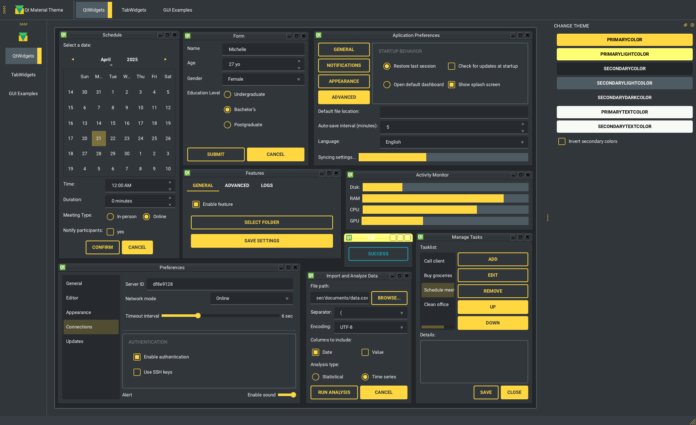
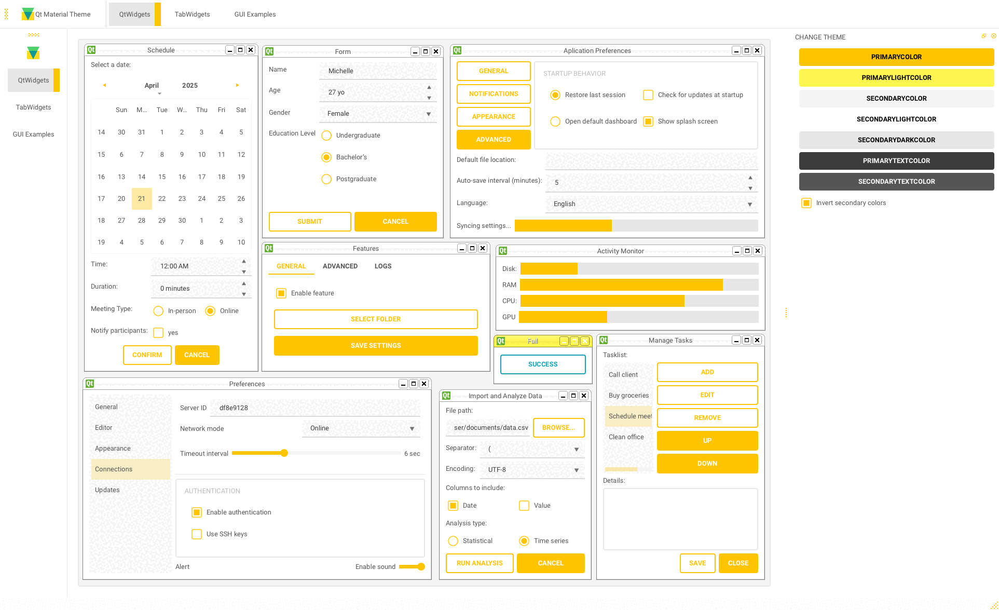

Qt-Material
===========

|GitHub top language| |PyPI - License| |PyPI| |PyPI - Status| |PyPI -
Python Version| |GitHub last commit| |CodeFactor Grade| |Documentation
Status|

.. |GitHub top language| image:: https://img.shields.io/github/languages/top/dunderlab/qt-material
.. |PyPI - License| image:: https://img.shields.io/pypi/l/qt-material
.. |PyPI| image:: https://img.shields.io/pypi/v/qt-material
.. |PyPI - Status| image:: https://img.shields.io/pypi/status/qt-material
.. |PyPI - Python Version| image:: https://img.shields.io/pypi/pyversions/qt-material
.. |GitHub last commit| image:: https://img.shields.io/github/last-commit/dunderlab/qt-material
.. |CodeFactor Grade| image:: https://img.shields.io/codefactor/grade/github/dunderlab/qt-material
.. |Documentation Status| image:: https://readthedocs.org/projects/qt-material/badge/?version=latest
   :target: https://qt-material.readthedocs.io/en/latest/?badge=latest

Qt-Material is a modern stylesheet library for **PySide6** and
**PyQt6**, inspired by Material Design.

It provides: - Dark and light themes - Custom accent colors and fonts -
Runtime theme switching - Export to ``.qss`` + ``.rcc`` for use in C++
or standalone apps - Density scaling for accessibility

Theme Previews
--------------

Qt-Material includes a variety of built-in themes, both in dark and
light modes.

**Dark themes:**

   dark

**Light themes:**

   light

Installation
------------

.. code:: bash

   pip install -U qt-material

Or from source:

.. code:: bash

   git clone https://github.com/dunderlab/qt-material.git
   cd qt-material
   pip install .

Documentation
-------------

Comprehensive usage guides, examples, and API reference are available
online:

-  📚 `Read the Docs – Official
   Documentation <https://qt-material.readthedocs.io/en/latest/>`__
-  📦 `PyPI – Package Distribution
   Only <https://pypi.org/project/qt-material/>`__

Basic Usage
-----------

To apply a Material Design-inspired stylesheet to your Qt application,
simply use ``apply_stylesheet()`` from the ``qt_material`` module.

Example using PySide6
~~~~~~~~~~~~~~~~~~~~~

.. code:: ipython3

    import sys
    from PySide6 import QtWidgets
    from qt_material import apply_stylesheet
    
    # Create application instance and main window
    app = QtWidgets.QApplication(sys.argv)
    window = QtWidgets.QMainWindow()
    
    # Apply a built-in theme
    apply_stylesheet(app, theme='dark_teal.xml')
    
    # Show the window and execute
    window.show()
    app.exec()

Optional: Using PyQt5 or PyQt6
~~~~~~~~~~~~~~~~~~~~~~~~~~~~~~

Just replace the import line:

.. code:: ipython3

    from PyQt5 import QtWidgets
    # or
    from PyQt6 import QtWidgets

Themes
------

To view all available built-in themes, use the ``list_themes()``
function:

.. code:: ipython3

    from qt_material import list_themes
    
    print(list_themes())

Example output:

.. code:: text

   ['dark_amber.xml',
    'dark_blue.xml',
    'dark_cyan.xml',
    'dark_lightgreen.xml',
    'dark_pink.xml',
    'dark_purple.xml',
    'dark_red.xml',
    'dark_teal.xml',
    'dark_yellow.xml',
    'light_amber.xml',
    'light_blue.xml',
    'light_cyan.xml',
    'light_cyan_500.xml',
    'light_lightgreen.xml',
    'light_pink.xml',
    'light_purple.xml',
    'light_red.xml',
    'light_teal.xml',
    'light_yellow.xml']

To apply any of these themes, pass the filename to
``apply_stylesheet()``:

.. code:: ipython3

    apply_stylesheet(app, theme='light_purple.xml')

Light themes
------------

When using a light theme, it’s recommended to enable
``invert_secondary=True`` to ensure text and contrast are properly
rendered for bright backgrounds.

.. code:: ipython3

    from qt_material import apply_stylesheet
    
    apply_stylesheet(app, theme='light_red.xml', invert_secondary=True)

This helps maintain proper visibility and icon behavior in light mode.

Environment Variables
---------------------

The following environment variables are related to the current theme
used. These variables are **for consultation purposes only**.

+--------------------------+-------------------------------+-----------+
| Environment Variable     | Description                   | Example   |
+==========================+===============================+===========+
| QTMATERIAL_PRIMARYCOLOR  | Primary color                 | #2979ff   |
+--------------------------+-------------------------------+-----------+
| QTMA                     | A bright version of the       | #75a7ff   |
| TERIAL_PRIMARYLIGHTCOLOR | primary color                 |           |
+--------------------------+-------------------------------+-----------+
| Q                        | Secondary color               | #f5f5f5   |
| TMATERIAL_SECONDARYCOLOR |                               |           |
+--------------------------+-------------------------------+-----------+
| QTMATE                   | A bright version of the       | #ffffff   |
| RIAL_SECONDARYLIGHTCOLOR | secondary color               |           |
+--------------------------+-------------------------------+-----------+
| QTMAT                    | A dark version of the         | #e6e6e6   |
| ERIAL_SECONDARYDARKCOLOR | secondary color               |           |
+--------------------------+-------------------------------+-----------+
| QTM                      | Color for text over primary   | #000000   |
| ATERIAL_PRIMARYTEXTCOLOR | background                    |           |
+--------------------------+-------------------------------+-----------+
| QTMAT                    | Color for text over secondary | #000000   |
| ERIAL_SECONDARYTEXTCOLOR | background                    |           |
+--------------------------+-------------------------------+-----------+
| QTMATERIAL_THEME         | Name of theme used            | light     |
|                          |                               | _blue.xml |
+--------------------------+-------------------------------+-----------+

Run examples
------------

A window with almost all widgets (see the previous screenshots) is
available to test all themes and **create new ones**.

.. code:: bash

   git clone https://github.com/UN-GCPDS/qt-material.git
   cd qt-material
   python setup.py install
   cd examples/full_features
   python main.py --pyside6

This will launch a live preview application where you can:

-  Browse all available themes
-  Switch stylesheets at runtime
-  Customize fonts and colors
-  Export your personalized theme

.. figure:: _images/theme.gif
   :alt: theme

   theme

Troubleshoots
-------------

QMenu
~~~~~

``QMenu`` may render differently depending on the Qt backend (PySide6,
PyQt6), platform, or even the style engine
(e.g. `Fusion <https://doc.qt.io/qt-5/qtquickcontrols2-fusion.html>`__).
This can affect spacing, height, and padding.

To improve appearance or fix spacing issues, you can manually define
``QMenu`` settings using the ``extra`` argument:

.. code:: python

   extra = {
       'QMenu': {
           'height': 50,
           'padding': '10px 20px 10px 20px'  # top, right, bottom, left
       }
   }

This customization is independent of the ``density_scale`` setting and
can be used to ensure consistent appearance across platforms.
